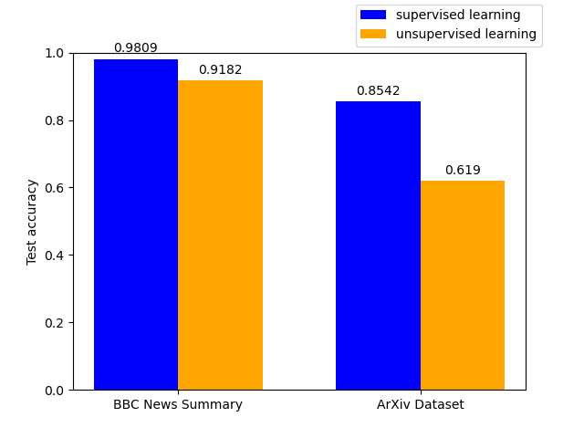

# Master thesis project

Topic:
*Comparison of natural language processing methods in topic classification and
modeling of informative and scientific articles*

The aim of this thesis was to study and compare the capabilities of natural language
processing methods in the fields of topic classification and modeling. The question
posed was in what extend do algorithms of unsupervised learning are capable to
substitute the supervised ones. Potential benefit which can be gained in the process
is automation of manual data labeling.

The examination included 4 datasets, 4 feature extraction methods, 5 classifiers and
3 topic modeling algorithms:
* Datasets: 20 Newsgroups, News Category Dataset, BBC News Summary, ArXiv Metadata
* Feature extraction: BOW, TF-IDF, Word2Vec, FastText
* Classifiers: Naive Bayes, Logistic Regression, SVM, SVM with SGD, Random Forest and
  Gradient Boosting Machines
* Modeling algorithms: LSI, LDA, NMF

During this work an experiment controller was created enabling fast test conducting.
Its input were configuration fields defining methods to be used.

#### Example experiment definition:

```python
def run_tc3_2():
    global dataset, feature_extraction_method, classifiers, experiment_controller
    dataset = Dataset.arxiv_metadata
    feature_extraction_method = FeatureExtractionMethod.WORD2VEC
    classifiers = [
        ClassificationMethod.Logistic_Regression,
        ClassificationMethod.Support_Vector_Machines,
        ClassificationMethod.SVM_with_SGD]

    experiment_controller = ExperimentController('tc#3.2', '2')
    experiment_controller.set_variables(dataset, feature_extraction_method,
                                        classifiers,
                                        should_load_embedding_model=False)
    experiment_controller.run_experiment()
```

Part of data preprocessing was done on Google Colab, due to computational time.

### Supervised vs unsupervised methods

For topic modeling two following datasets were used.



BBC News Summary is news dataset with 5 categories, while ArXiv Dataset
contains scholar articles in 8 fields. Supervised methods proved definitely better,
but ~6% accuracy loss may be tempting price for skipping manual labeling in case of
the first dataset. In ArXiv, unsupervised methods achieved much worse score, still
they could be possibly used as a suggestion system for manual labelling.

Quite important matter is that scholar articles dataset requires much more
specialized knowledge than news. Despite that and the fact that ArXiv had more
categories, the difference between their best scores isn't as tremendous. This
suggests that classification algorithms do not simply automate manual work, but also
are more insensitive to topic expertise.

Also, an experiment with Arxiv dataset containing 18 categories. Physics was 
expanded into 13 distinct subcategories. Best test score achieved was 0.8155. 
Again, there was a big scholar knowledge requirement raise, exceeding the 
author's of this work capabilities. The ~4% score loss seems disproportional, 
confirming presented algorithms' insensitivity to topic expertise.
